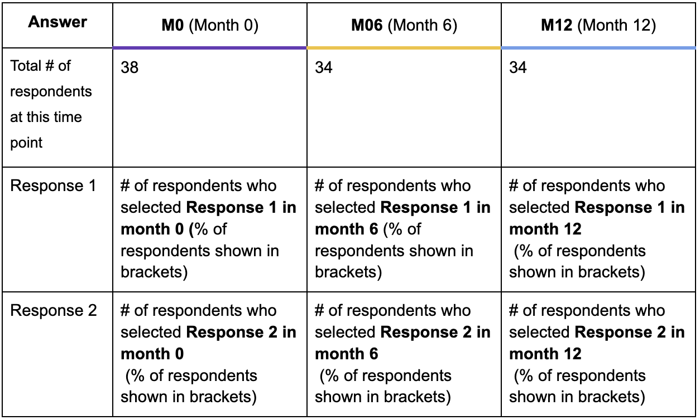
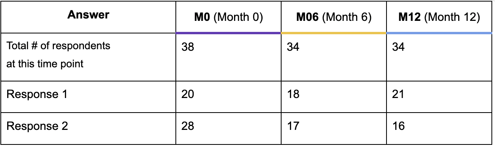
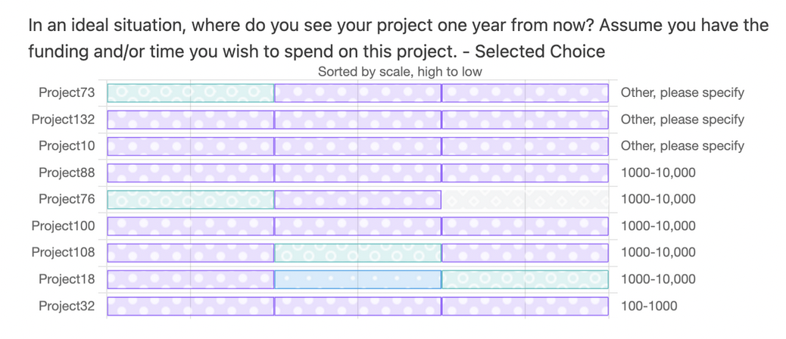
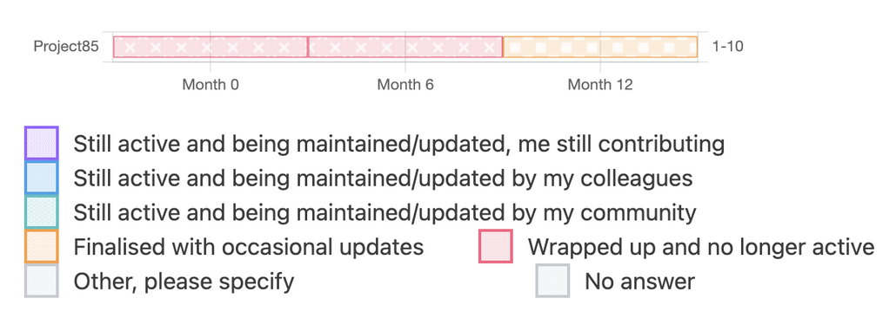

## Data presentation guide
Visualising data that changes over time can result in complex graphs. While we have made our best effort to present data as clearly as possible without oversimplifying, this section explains some of the data presentation methods with illustrative examples.

## Single-answer questions
Throughout this section, we present data from all three time points side by side. Tables summarising respondent responses to radio-button single-answer questions usually consist of an answer column, and three time-point columns, as illustrated below:

*Example data table to illustrate data presentation format. *

## Survey: Multiple choice questions
Some tables contain answers to check-box multiple choice questions. In this case, respondents may choose more than one option. The total number of respondents is still shown at the top of the table, but note that each individual respondent may have chosen more than one option, so summing up the count of responses to each question may add up to a number higher than expected. Illustrative example below using mock data - in month 0, summing response 1 and response 2 adds up to a count of 48 responses, even though we only have 38 total respondents. This is because 10 respondents chose BOTH response 1 AND response 2. 

*Example data table for multi-choice questions, where the total of responses may add up to more than the total number of responses*

## Visualisations
In some cases, we have presented graphs which visualise responses from each individual project over time. These graphs are presented as bar charts, with a structure similar to the table format above. Project names are shown on the left, followed by three colour-coded bars representing a project’s response at each of the three time points. These graphs are sorted either by project founding date (older projects at the top, younger projects at the bottom), or by a project’s self-reported size at month 0. Illustrative example, using real data, shown in the figure below:

 (... graph middle section truncated to save space)

*Example of three-survey data visualisation, showing responses at an individual project level over time.*

In the figure above, moving left-to-right, the first column with coloured bars represents responses from each project in month 0, the middle column represents responses in month 6, and the right-most coloured bar column is month 12 responses. 

To illustrate the flow of time descriptively, Project 85, one of the smallest projects shown in this graph, predicted in months 0 and 6 that it would be completely inactive in one year, but in month 12 (one year after month 0), they reported that they thought the project still might get occasional updates in the future. Projects 132, 10, 88, 100, and 32 all thought their project would still be active in one year’s time, and did not see themselves leaving the project. This stayed consistent throughout all three timepoints. 

